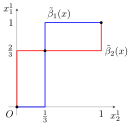

<style>
img[alt~="center"] {
  display: block;
  margin: 0 auto;
}
</style>

# ゲーム理論の基礎 (非協力ゲーム)

<!--
_class: lead
_pagenate: false
_header: ""
-->

## 目次
- 戦略型ゲーム
  - 戦略型ゲームの定義
  - 最適反応とナッシュ均衡
  - 混合戦略と混合戦略ナッシュ均衡
  - 数値計算

## 1. 戦略型ゲーム
### 1.1. 戦略型ゲームの定義
戦略型ゲーム：複数の意思決定主体間の相互作用を表す数理モデル

- 意思決定主体は自分自身の**行動** (純粋戦略) を選択する
  - 行動に対して**利得**が与えられている
  - 利得は、自分の行動と他の意思決定主体の行動に依存して決まる

数学的に戦略型ゲームを定義する。

---

###### Def (戦略型ゲーム)
戦略型ゲーム $G$ は、タプル $G = (\mathcal{N}, S, U)$ として定義される。
ただし、

- $\mathcal{N} = \{1, 2, \ldots, n\}$: プレイヤーの集合 (有限集合)
- $S = \times_{k \in \mathcal{N}} S_k$: 純粋戦略空間
  - $S_k$: プレイヤー $k$ の純粋戦略集合
- $U: S \to \mathbb{R}^n$: 利得関数、$U(s) = (U_1(s), \ldots, U_n(s))$
  - $U_k: S \to \mathbb{R}$: プレイヤー $k$ の利得関数

---

###### 例：囚人のジレンマ

$\mathcal{N} = \{1, 2\}$, $S_1 = S_2 = \{C, NC\}$, $U$ は以下の表のように定義。

|$1$ \ $2$|$C$|$NC$|
|---|---|---|
|$C$|$(-2, -2)$|$(-10, 0)$|
|$NC$|$(0, -10)$|$(-5, -5)$|

プレイヤー $1$ が戦略 $C$、プレイヤー $2$ が戦略 $NC$ をとったとき

- プレイヤー $1$ の利得：$-10$
- プレイヤー $2$ の利得：$0$

---
##### 補足
$e_m^i \in \mathbb{R}^m$：第$i$要素のみが$1$であるような$m$次元単位ベクトル

とする。$2$人ゲームの利得は行列 (利得行列) として表現される。

$i \in S_1, j \in S_2$ に対して、

$$U_1(i,j) = \left(e_{|S_1|}^i \right)^{\mathrm{T}} A e_{|S_2|}^j, \ U_2(i,j) = \left(e_{|S_1|}^i \right)^{\mathrm{T}} B e_{|S_2|}^j$$


- $A = (a_{i,j})_{1 \leq i \leq |S_1|, 1 \leq j \leq |S_2|}$, $a_{i,j} = U_1(i,j)$
- $B = (b_{i,j})_{1 \leq i \leq |S_1|, 1 \leq j \leq |S_2|}$, $b_{i,j} = U_2(i,j)$

---
プレイヤー$1$、プレイヤー$2$の利得行列 $A, B$ は以下のようになる。

$$A = \left( \begin{array}{ccc} a_{1,1} & \cdots & a_{1, |S_2|} \\ \vdots & & \vdots \\ a_{|S_1|, 1} & \cdots & a_{|S_1|, |S_2|} \end{array} \right), \; \; B = \left( \begin{array}{ccc} b_{1,1} & \cdots & b_{1, |S_2|} \\ \vdots & & \vdots \\ b_{|S_1|, 1} & \cdots & b_{|S_1|, |S_2|} \end{array} \right)$$

囚人のジレンマの例では、

$$A = \left( \begin{array}{cc} -2 & -10 \\ 0 & -5 \end{array} \right), \; \; B = \left( \begin{array}{cc} -2 & 0 \\ -10 & -5 \end{array} \right) $$

となる。

---
### 1.2 最適反応とナッシュ均衡

$s_{-k} \coloneqq (s_1, \ldots, s_{k-1}, s_{k+1}, s_n)$ とする。

###### Def (最適反応)
$s_k^{*} \in S_k$ が $s_{-k}$ に対する純粋最適反応 $\overset{\text{def}}{\Longleftrightarrow}$

$$\forall s_k \in S_k, \ \ U_k(s_k^{*}, s_{-k}) \geq U_k(s_k, s_{-k})$$

- 他のプレイヤーの行動を固定したときの最適な行動
- 等価な条件は、$U_k(s_k^{*}, s_{-k}) = \max_{s_k \in S_k} U_k(s_k, s_{-k})$
- 1つとは限らないが、必ず存在する

---
###### Def (ナッシュ均衡)
$s^{*} \in S$ が (純粋戦略) ナッシュ均衡 $\overset{\text{def}}{\Longleftrightarrow}$

$$\forall k \in \mathcal{N}, \forall s_k \in S_k, \ \ U_k(s_k^{*}, s_{-k}^{*}) \geq U_k(s_k, s_{-k}^{*})$$

- 自分だけが行動を変更しても得をしない
- 等価な条件は、$\forall k \in \mathcal{N}, \ \ U_k(s_k^{*}, s_{-k}^{*}) = \max_{s_k \in S_k} U_k(s_k, s_{-k}^{*})$
- 1つとは限らず、存在しない場合もある
- すべてのプレイヤーにとって合理的
  - 実現すればそこから動かない。どのように実現するかは考えない。

---

###### 例：囚人のジレンマ

|$1$ \ $2$|$C$|$NC$|
|---|---|---|
|$C$|$(-2, -2)$|$(-10, 0)$|
|$NC$|$(0, -10)$|$(-5, -5)$|

- プレイヤー$2$の戦略を$C$に固定したときのプレイヤー$1$の利得
  - プレイヤー$1$が$C$をとる：$-2$、プレイヤー$1$が$NC$をとる：$0$
- プレイヤー$2$の戦略を$NC$に固定したときのプレイヤー$1$の利得
  - プレイヤー$1$が$C$をとる：$-10$、プレイヤー$1$が$NC$をとる：$-5$
  

---

プレイヤー$1$の戦略を固定したときも同様。

- 最適反応
  - $C$ に対して $NC$
  - $NC$ に対して $NC$

- ナッシュ均衡：$(NC, NC)$
  - 囚人のジレンマでは、ナッシュ均衡はパレート最適ではない。
    - パレート最適：自分の利得を上げるには他のプレイヤーの利得を悪化させる状態
  - 双方のプレイヤーにとって利得が一番良いのは $(C, C)$ となること。

---

### 1.3 混合戦略と混合戦略ナッシュ均衡
ゲーム $G = (\mathcal{N}, S, U)$ を考える。$S_k$ 上の確率分布 $X_k$ をプレイヤー $k$ の混合戦略と呼ぶ。$X_k$ は以下のように表される。

$X_k = \left\{x_k = \left. \left( \begin{array}{c} x_k^1 \\ \vdots \\ x_k^{|S_k|} \end{array} \right) \, \right| \, \forall i \in S_k \ x_k^i \geq 0, \ \sum_{j \in S_k} x_k^j = 1 \right\}$

また、純粋戦略空間 $S$ に対応する混合戦略空間 $X$ は、

$$X = \times_{k \in \mathcal{N}} X_k$$

---
###### 補足
$X_k$ は単位ベクトル $e_{|S_k|}^i \ (\forall i \in S_k)$ を頂点とする $|S_k| - 1$ 次元単位単体となる。 
$S_k = \{1,2\}$ のとき、混合戦略 $x_k = (x_k^1, x_k^2)^{\mathrm{T}}$ は、線分 $x_k^1 + x_k^2 = 1$, $0 \leq x_k^i \leq 1 \ (i = 1,2)$ 上の点である。


---

以下の記号を定義する。

- $x \coloneqq (x_1, \ldots, x_n) \in X$
- $x_{-k} \coloneqq (x_1, \ldots, x_{k-1}, x_{k+1}, \ldots, x_n)$
- $x(s) \coloneqq \prod_{i \in \mathcal{N}} x_i^{s_i}$：$x \in X$ で $s \in S$ が実際に起こる確率

利得関数の混合戦略への拡張 (期待利得関数) は、以下で定義される。

- $u: X \to \mathbb{R}^n$, $u(x) = (u_1(x), \ldots, u_n(x))$
  - $u_k: X \to \mathbb{R}$

$$u_k(x) = \sum_{s \in S} x(s) U_k(s) = \sum_{i \in S_k} x_k^i u_k \left( e_{|S_k|}^i, x_{-k} \right)$$

--- 

ゲーム $G = (\mathcal{N}, S, U)$ は、$G = (\mathcal{N}, X, u)$ に拡張される。

$2$人ゲームとき、利得関数 $u_1, u_2$ は利得行列 $A, B$ を用いて以下のように表現される。

$$u_1(x) = \sum_{s \in S} x(s) U_1(s) = \sum_{s \in S} x_1^{s_1} x_2^{s_2} U_1(s_1, s_2)$$
$$= \sum_{s_1 \in S_1} \sum_{s_2 \in S_2} x_1^{s_1} x_2^{s_2} a_{s_1, s_2} = x_1^{\mathrm{T}} A x_2$$

$$u_2(x) = \sum_{s_1 \in S_1} \sum_{s_2 \in S_2} x_1^{s_1} x_2^{s_2} b_{s_1, s_2} = x_1^{\mathrm{T}} B x_2$$

---
###### 例：囚人のジレンマ

混合戦略集合 $X_k \ (k = 1, 2)$ は以下のように定義される。

- $X_k = \left\{ x_k \in \mathbb{R}^2 \, \left| \, x_k = (x_k^1, 1 - x_k^1)^{\mathrm{T}}, \ 0 \leq x_k^1 \leq 1  \right. \right\} \ (k = 1, 2)$

利得関数 $u_1: X \to \mathbb{R}, \, u_2: X \to \mathbb{R}$ は以下のように定義される。

$$u_1(x) = x_1^{\mathrm{T}} A x_2 = \left( \begin{array}{cc} x_1^1 & 1 - x_1^1 \end{array} \right) \left( \begin{array}{cc} -2 & -10 \\ 0 & -5 \end{array} \right) \left( \begin{array}{c} x_2^1 \\ 1 - x_2^1 \end{array} \right)$$

$$u_2(x) = x_1^{\mathrm{T}} B x_2 = \left( \begin{array}{cc} x_1^1 & 1 - x_1^1 \end{array} \right) \left( \begin{array}{cc} -2 & 0 \\ -10 & -5 \end{array} \right) \left( \begin{array}{c} x_2^1 \\ 1 - x_2^1 \end{array} \right)$$

---

###### Def (最適反応)
$s_k^{*} \in \beta_k(x)$ を $x_{-k}$ に対する**純粋**戦略最適反応、
$x_k^{*} \in \tilde{\beta}_k(x)$ を $x_{-k}$ に対する**混合**戦略最適反応と呼ぶ。

- 純粋戦略最適反応対応 $\beta_k: X \to 2^{S_k}$:
    $$\beta_k(x) = \left\{ i \in S_k \, \left| \, \forall j \in S_k \ u_k\left(e_{|S_k|}^i, x_{-k}\right) \geq u_k\left(e_{|S_k|}^j, x_{-k}\right) \right. \right\}$$

- 混合戦略最適反応対応 $\tilde{\beta}_k: X \to 2^{X_k}$:
    $$\tilde{\beta}_k(x) = \left\{ x_k^{*} \in X_k \, \left| \, \forall x_k^{\prime} \in X_k \ u_k\left(x_k^{*}, x_{-k}\right) \geq u_k\left(x_k^{\prime}, x_{-k}\right) \right. \right\}$$

---
###### Def (ナッシュ均衡)
$x^{*} \in \tilde{\beta}(x^{*})$ が成り立つとき、$x^{*}$ をナッシュ均衡という。

$$\tilde{\beta}(x) \coloneqq \times_{k \in \mathcal{N}} \beta_k(x) \subseteq X$$

- ナッシュ均衡
  - すべてのプレイヤーにとって合理的な解
  - 有限ゲームでは必ず存在 (複数存在する可能性あり)

---
###### 例：調整ゲーム
|$1$ \ $2$|$1$|$2$|
|---|---|---|
|$1$|$(2, 1)$|$(0, 0)$|
|$2$|$(0, 0)$|$(1, 2)$|

$$A = \left( \begin{array}{cc} 2 & 0 \\ 0 & 1 \end{array} \right), \ B = \left( \begin{array}{cc} 1 & 0 \\ 0 & 2 \end{array} \right)$$

---
プレイヤー$2$の混合戦略を $x_2 = (x_2^1, 1 - x_2^1)^{\mathrm{T}}$ で固定する。プレイヤー$1$が純粋戦略をとるときの期待利得は、

$$u_1(e_2^1, x_2) = \left( \begin{array}{cc} 1 & 0 \end{array} \right) \left( \begin{array}{cc} 2 & 0 \\ 0 & 1 \end{array} \right) \left( \begin{array}{c} x_2^1 \\ 1 - x_2^1 \end{array} \right) = 2x_2^1$$

$$u_1(e_2^2, x_2) = \left( \begin{array}{cc} 0 & 1 \end{array} \right) \left( \begin{array}{cc} 2 & 0 \\ 0 & 1 \end{array} \right) \left( \begin{array}{c} x_2^1 \\ 1 - x_2^1 \end{array} \right) = 1 - x_2^1$$

$$\therefore u_1(e_2^1, x_2) - u_1(e_2^2, x_2) = -1 + 3x_2^1$$

---
プレイヤー$1$の混合戦略を$x_1 = (x_1^1, 1 - x_1^1)^{\mathrm{T}}$で固定する。プレイヤー$2$が純粋戦略をとるときの期待利得は、

$$u_2(e_2^1, x_1) = \left( \begin{array}{cc} x_1^1 & 1 - x_1^1 \end{array} \right) \left( \begin{array}{cc} 1 & 0 \\ 0 & 2 \end{array} \right) \left( \begin{array}{c} 1 \\ 0 \end{array} \right) = x_1^1$$

$$u_2(e_2^2, x_1) = \left( \begin{array}{cc} x_1^1 & 1 - x_1^1 \end{array} \right) \left( \begin{array}{cc} 1 & 0 \\ 0 & 2 \end{array} \right) \left( \begin{array}{c} 0 \\ 1 \end{array} \right) = 2 - 2x_1^1$$

$$\therefore u_2(e_2^1, x_1) - u_2(e_2^2, x_1) = -2 + 3x_1^1$$

---

混合戦略最適反応対応 $\tilde{\beta}_k(x) \ (k = 1, 2)$ は、

$$\tilde{\beta}_1(x) = \begin{cases} e_2^1 & \text{if} \ x_2^1 > \frac{1}{3} \\ X_1 & \text{if} \ x_2^1 = \frac{1}{3} \\ e_2^2 & \text{if} \ x_2^1 < \frac{1}{3} \end{cases} $$

$$\tilde{\beta}_2(x) = \begin{cases} e_2^1 & \text{if} \ x_1^1 > \frac{2}{3} \\ X_2 & \text{if} \ x_1^1 = \frac{2}{3} \\ e_2^2 & \text{if} \ x_1^1 < \frac{2}{3} \end{cases} $$

と求められる。

---



ナッシュ均衡は

$$x^{*} \in \left\{ (e_2^1, e_2^1), (e_2^2, e_2^2), \left( \left(\frac{2}{3}, \frac{1}{3} \right)^{\mathrm{T}}, \left(\frac{1}{3}, \frac{2}{3} \right)^{\mathrm{T}} \right) \right\}$$

---
### 1.4 数値計算
Python の `nashpy` というパッケージを使うと、2人ゲームの定義、ナッシュ均衡の導出が可能。

```
python3 -m venv ~/.venvs/game_numerical
source ~/.venvs/game_numerical/bin/activate
(game_numerical) pip install --upgrade pip
(game_numerical) pip install -r requirements.txt
```

`requirements.txt` には、`numpy`, `nashpy`, `jupyter`, `ipykernel` が記述されていれば良い。

---
例：じゃんけん

```python
A = np.array([[0, 1, -1],
              [-1, 0, 1],
              [1, -1, 0]])
B = np.array([[0, -1, 1],
              [1, 0, -1],
              [-1, 1, 0]])
coordination_game = nash.Game(A, B)
coordination_game
```

---

```
Zero sum game with payoff matrices:

Row player:
[[ 0  1 -1]
 [-1  0  1]
 [ 1 -1  0]]

Column player:
[[ 0 -1  1]
 [ 1  0 -1]
 [-1  1  0]]
```

---

```python
equilibria = coordination_game.vertex_enumeration()
for eq in equilibria:
    print(eq)
```

```
(array([0.33333333, 0.33333333, 0.33333333]), array([0.33333333, 0.33333333, 0.33333333]))
```

---
### 参考文献
[1] 岡田章, *ゲーム理論*, 2011.
[2] H. Peter, *Game Theory: A Multi-Leveled Approach*, Springer, 2015.
[3] [Nashpy's documentation](https://nashpy.readthedocs.io/en/stable/index.html), accessed on 08/06/2022
