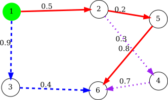

# ゲーム理論の応用 (グラフのパス選択)

<!--
_class: lead
_pagenate: false
_header: ""
-->

## 目次

- 考える状況
- 定式化
- 具体例

## 1. 考える状況

- $\mathcal{H} = (\mathcal{V}, \mathcal{E})$ で重み付きグラフが定義される。
    - $v \in \mathcal{V}$：ホスト、$(u, v) \in \mathcal{E}$：ホスト間の接続関係 $(u, v \in \mathcal{V})$
    - 重み $w_{u,v} \in \mathbb{R}$ ：エッジの影響度 ($1$ で正規化) $((u, v) \in \mathcal{E})$

 

--- 
- あるホスト $v_0 \in \mathcal{V}$ からのパスの集合 $S_A$ が与えられている。
    - $S_A = \{p_1, \ldots, p_n\}$
        - $p_i = \{(v_0, v_1), \ldots, (v_{\ell - 1}, v_{\ell})\}$ ($v_0 \in \mathcal{V}$ からのパス)

---

- 2人のプレイヤー $A, D$ が存在し、以下のように振舞う。
    - $D$ は**パスを達成させないための**戦略をとる
        - 例：ファイアウォールなどのセキュリティ上の対策を選ぶ
    - $A$ は $D$ の戦略の下で『**一番良い**』パスを選択する
        - 例：考えられる攻撃経路を選択する

$\Rightarrow$ $A$ と $D$ の間の相互作用は**ゲーム** $G = (\{A, D\}, S_A \times S_D, U)$ として表現される。

- $S_A$：$A$ の戦略集合、$S_D$：$D$ の戦略集合
- $U(s) = (U_A(s), U_D(s)), \ s = (s_A, s_D) \in S_A \times S_D$

## 2. 定式化

### 2.1 戦略集合
$A$ の戦略集合 $S_A$ と $D$ の戦略集合 $S_D$ を

$$S_A = \{p_1, p_2, \ldots, p_n\}$$
$$S_D = \{ d_1, d_2, \ldots, d_m \}$$

とする。ただし、$p_i \in S_A$ はホスト $v_0 \in \mathcal{V}$ からのパス $\{(v_0, v_1), \ldots, (v_{\ell - 1}, v_{\ell})\}$ とする。

---

### 2.2 利得

$p_i \in S_A, d_j \in S_D$ に対して、$U_A: S_A \times S_D \to \mathbb{R}$ を以下で定義。

$$U_A(p_i, d_j) = f_A(p_i) - g_A(p_i, d_j)$$

- $f_A: S_A \to \mathbb{R}$：パスの深刻さ
    - 例：(重みの総和)/(パスの長さ) + (定数)
- $g_A: S_A \times S_D \to \mathbb{R}$：対策のパスへの影響
    - 例：$g_A(p_i, d_j) > 0 \ \forall p_i \in S_A, \forall d_j \in S_D$ で、より早く検知・遮断されると値が大きい

---

$p_i \in S_A, d_j \in S_D$ に対して、$U_D: S_A \times S_D \to \mathbb{R}$ を以下で定義。

$$U_D(p_i, d_j) = f_D(p_i, d_j) - g_D(d_j)$$

- $f_D: S_A \times S_D \to \mathbb{R}$：対策の効果 (パスを防ぐことができたか)
    - 例：より早く検知・遮断できると値が大きい
- $g_D: S_D \to \mathbb{R}$：対策のコスト
    - 例：$g_D(d_j) > 0 \ \forall d_j \in S_D$ で、コストが高いほど値が大きい

## 3. 具体例
グラフ $\mathcal{H} = (\mathcal{V}, \mathcal{E})$ とパス $p_1, p_2, p_3$ が与えられているとする。
- $\mathcal{V} = \{1, 2, 3, 4, 5, 6\}$
- $\mathcal{E} = \{(1,2), (1,3), (2,4), (2,5), (3,6), (4,6), (5,6) \}$
- $w_{1,2} = 0.5, w_{1,3} = 0.9, w_{2,4} = 0.3, w_{2,5} = 0.2, w_{3,6} = 0.4, w_{4,6} = 0.7, w_{5,6} = 0.8$

---
- $p_1 = \{(1,2), (2,4), (4,6)\}$
- $p_2 = \{(1,2), (2,5), (5,6)\}$
- $p_3 = \{(1,3), (3,6)\}$

このグラフおよびパスは、以下のように図示される。

---

プレイヤー $A$ の戦略集合を、$S_A = \{p_1, p_2, p_3\}$ とし、プレイヤー $D$ の戦略集合を $S_D = \{d_1, d_2, d_3, d_4\}$ とする。$p_i \in S_A$ に対して $f_A(p_i)$ を以下のように定義する。

$$f_A(p_1) = \frac{0.5 + 0.3 + 0.7}{3} + 1 = 1.5$$
$$f_A(p_2) = \frac{0.5 + 0.2 + 0.8}{3} + 1 = 1.5$$
$$f_A(p_3) = \frac{0.9 + 0.4}{2} + 1 = 1.65$$

---
また、$p_i \in S_A, d_j \in S_D$ に対して $g_A(p_i, d_j)$ および $f_D(p_i, d_j)$ を以下の表のように定義する。

|$A$ \ $D$|$d_1$|$d_2$|$d_3$|$d_4$|
|---|---|---|---|---|
|$p_1$|$0$|$0.5$|$1.25$|$2.25$|
|$p_2$|$0$|$0.25$|$0.75$|$1.5$|
|$p_3$|$0$|$0.5$|$1.5$|$2.0$|

---
さらに、$d_j \in S_D$ に対して $g_D(d_j)$ を以下のように定義する。

$$g_D(d_1) = 0$$
$$g_D(d_2) = 0.25$$
$$g_D(d_3) = 0.75$$
$$g_D(d_4) = 2.0$$

---
以上より、利得は以下の表で表される。

||$d_1$|$d_2$|$d_3$|$d_4$|
|---|---|---|---|---|
|$p_1$|$(1.5, 0)$|$(1.0, 0.25)$|$(0.25, 0.5)$|$(-0.75, 0.25)$|
|$p_2$|$(1.5, 0)$|$(1.25, 0)$|$(0.75, 0)$|$(0, -0.5)$|
|$p_3$|$(1.65, 0)$|$(1.15, 0.25)$|$(0.15, 0.75)$|$(-0.35, 0)$|

---
プレイヤー $A, D$ の利得行列 $M_A, M_D$ は、

$$M_A = \left( \begin{array}{cccc} 1.5 & 1.0 & 0.25 & -0.75 \\ 1.5 & 1.25 & 0.75 & 0 \\ 1.65 & 1.15 & 0.15 & -0.35 \end{array} \right)$$

$$M_D = \left( \begin{array}{cccc} 0 & 0.25 & 0.5 & 0.25 \\ 0 & 0 & 0 & -0.5 \\ 0 & 0.25 & 0.75 & 0 \end{array} \right) $$

---

数値計算より、ナッシュ均衡 は以下の4つ。

$$\left( \left( \begin{array}{c} 0 \\ 1 \\ 0 \end{array} \right), \left( \begin{array}{c} 0 \\ 0 \\ 1 \\ 0 \end{array} \right) \right), \left( \left( \begin{array}{c} 0 \\ 1 \\ 0 \end{array} \right), \left( \begin{array}{c} 0 \\ 1 \\ 0 \\ 0 \end{array} \right) \right),$$
$$\left( \left( \begin{array}{c} 0 \\ 1 \\ 0 \end{array} \right), \left( \begin{array}{c} 0.8 \\ 0 \\ 0.2 \\ 0 \end{array} \right) \right), \left( \left( \begin{array}{c} 0 \\ 1 \\ 0 \end{array} \right), \left( \begin{array}{c} 0.4 \\ 0.6 \\ 0 \\ 0 \end{array} \right) \right).$$

---
##### 結果
- プレイヤー $A$ の最適な行動は、確率 $1$ で $p_2$ を選ぶこと
- プレイヤー $D$ の最適な行動は以下。
    - 確率 $1$ で $d_3$ を選ぶ
    - 確率 $1$ で $d_2$ を選ぶ
    - 確率 $0.8$ で $d_1$、確率 $0.2$ で $d_3$ を選ぶ
    - 確率 $0.4$ で $d_1$、確率 $0.6$ で $d_2$ を選ぶ

---
##### 考察
- 対策によって防ぐのが難しいという点で $p_2$ がクリティカルなパスになっている。
- 対策 $d_4$ はコストの観点で良い対策とは言えない。同程度の性能でより安価なものを選定するべき。
- 対策 $d_3$ は比較的安価である程度有効だが、$p_2$ に対する効果は薄い。

---
### 参考文献
[1] B. Wang, J. Cai, S. Zhang and J. Li, "A network security assessment model based on attack-defense game theory," 2010 International Conference on Computer Application and System Modeling (ICCASM 2010), 2010, pp. V3-639-V3-643.
